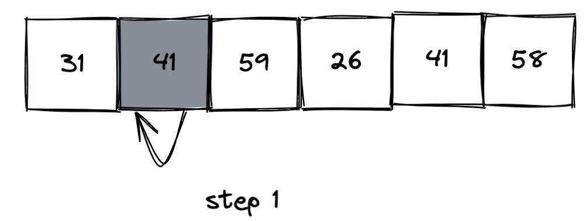
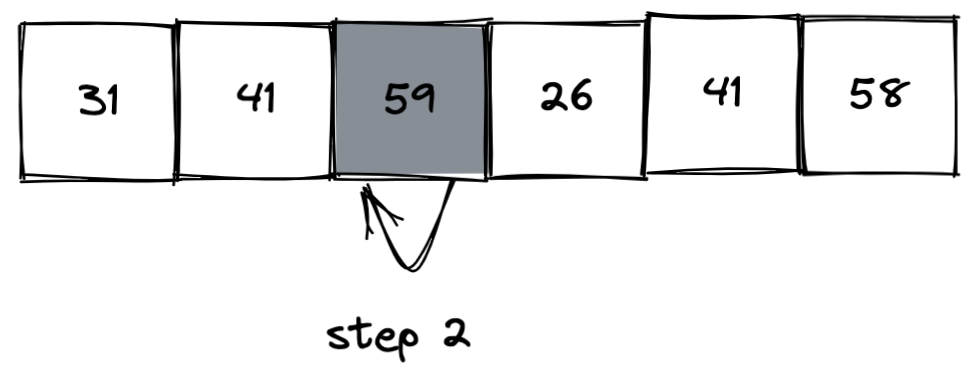
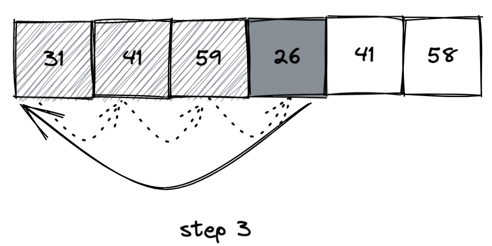
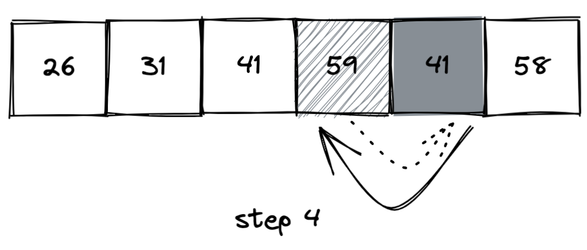
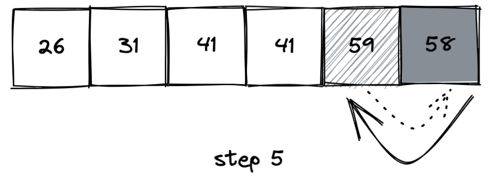
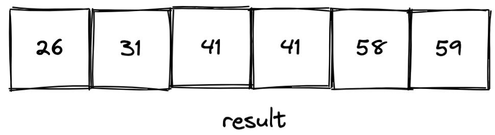

## 2.1-1 以图2.2为模型，说明INSERTION-SORT在数组A={31, 41, 59, 26, 41, 58}上的执行过程







## 2.1-2 重写过程INSERTION-SORT,使之按非升序(而不是非降序)排序
```cpp
INSERTION-SORT-DESC(A)
    for j=2 to A.length
        key = A[j]
        i = j - 1
        while i > 0 and A[i] < key 
            A[i+1] = A[i]
            i = i - 1
        A[i+1] = key
```

## 2.1-3 考虑以下查找问题：
- 输入：n个数的一个序列A=<a1,a2,...,an>和一个值v
- 输出：下标i，使得v=A[i]或者当v不在A中出现时，v为特殊值NIL.
- 写出线性查找的伪代码，它扫描整个序列来查找v。使用循环不变式来证明你算法的正确性。确保你的循环不变式满足三条必要的性质。
```
LINEAR-SEARCH(A,v)
    for j=1 to A.length
        if A[j] == v 
            return j
    return NIL
```
- 循环不变式的证明
```
循环不变可以理解为循环过程中，保持某些状态或者性质的不变。这里可以理解为，状态一：在A中找到v，退出循环。状态二：在A中未找到v，可以继续进行下一次循环。
初始化：首先证明第一次循环前，循环不变式成立。第一次循环前数组中的内容是空的，v不在数组A中，是状态二，且循环没有终止，故循环不变式成立。
保持：当进行到第i次循环时，如果在A中找到v，则退出循环，同时满足A[1...i-1]中，没有v。如果没有找到v，则会进入下一次循环，循环不变式保持真的状态。
终止：导致for循环终止的条件是j > A.length，或者某次循环找到v。如果是找到v终止，此时我们正确的返回了下标。如果是j = n+1 终止，我们已经遍历了整个数组，且A[1...j]与v是不同的，我们正确的返回了NIL。证明算法是正确的。
```

## 2.1-4 考虑把两个n位二进制整数加起来的问题，这两个整数分别存储在两个n元数组A和B中。这两个整数的和应按二进制形式存储在一个(n+1)元数组C中。请给出该问题的形式化描述，并写出伪代码

#### **形式化的表示**
输入：给定两个二进制数组 $A=<a_1,a_2,...,a_n>$和 $B=<b_1,b_2,...,b_n>$, 每个二进制数组表示一个整数，其中高位在前，低位在后( $a_1$ 比 $a_n$ )的位数高。
输出：输出一个二进制数组 $C=<c_1, c_2, ..., c_{n+1}>$ 表示 $A$ 和 $B$的和。
#### **伪代码**
```
BINARY-ADD(A,B)
    carry = 0
    C = Integer[1...A.length+1]
    for i = A.length downto 1
        c = A[i]+B[i]+carry
        C[i+1] = c%2
        carry = c/2 // 这里可以自动取整
    C[1] = carry
    return C
```